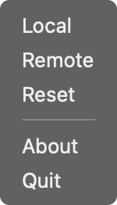
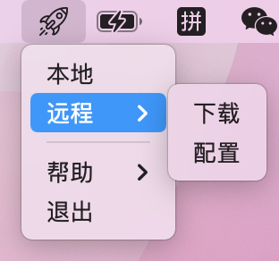
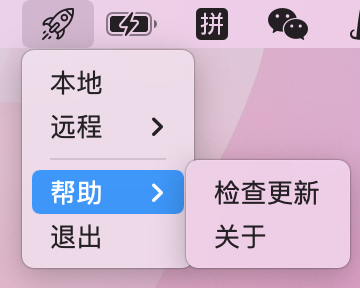
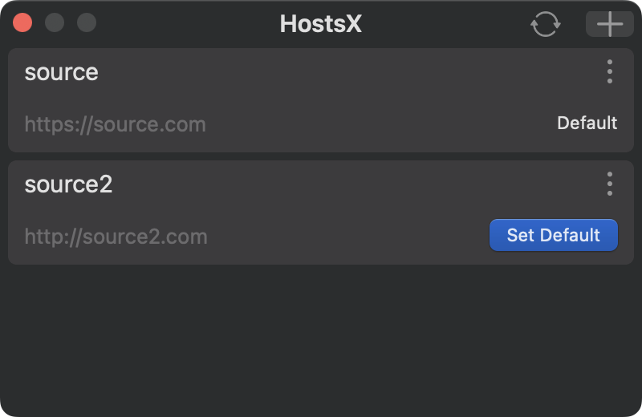
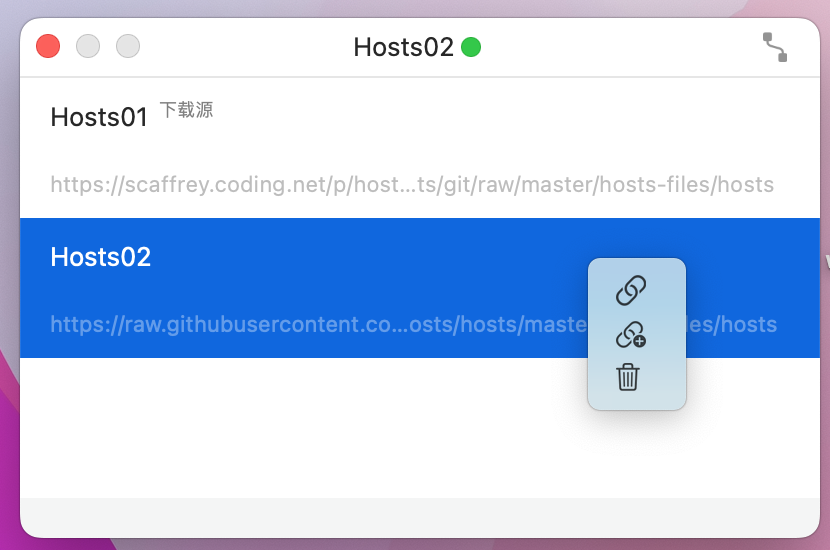
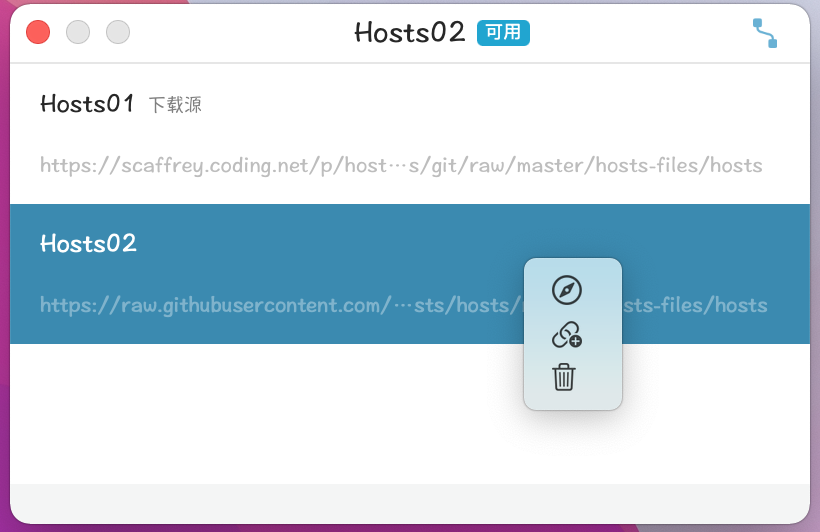

<!-- []()  -->
<h1>
HostsX</br>
<a href="https://github.com/ZzzM/HostsX/releases/latest"></a>
<a href="https://github.com/ZzzM/HostsX/releases/latest"></a>
<a href="https://raw.githubusercontent.com/ZzzM/HostsX/master/LICENSE"></a>
<a href="https://zzzm.github.io/2020/02/24/hostsx/">

</a>
</h1>

A lightweight macOS App for updating local hosts

## Features
- [x] Internationalization (简体中文、English)
- [x] Dark mode

## Compatibility
- Requires **macOS 10.12** or later

## Changlogs
- [简体中文](CHANGELOG_SC.md)
- [English](CHANGELOG.md)

## Snapshots
- Menu

   
  
- Remote configuration
 
 


## Note
- Add DNS entries between `# My Hosts Start` and `# My Hosts End`
```
# My Hosts Start

0.0.0.0 www.example0.com
1.1.1.1 www.example1.com
2.2.2.2 www.example2.com

# My Hosts End
```

