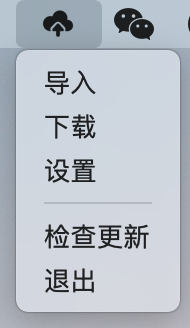
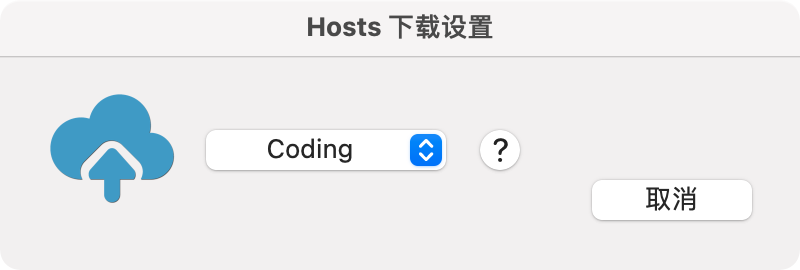

# HostsToolforMac

一款轻量级本地 hosts 更新工具。
- 开发语言：Swift 
- 运行环境：macOS 10.12 或以上 
- 在线更新：需要将解压好的App放至应用程序文件夹
- [下载地址](https://github.com/ZzzM/HostsToolforMac/releases/download/2.7.0/HostsToolForMac.zip)

## 版本

| 版本 |  说明 |
| ----  | ---- |
| 2.6.0 | 更新菜单 更新设置面板 支持在线更新 |
| 2.6.1 | - |
| 2.7.0 | 更新菜单 更新设置面板 新增下载提示面板 适配 macOS Big Sur 11.0.1|

## 预览
- 主页

  
- 下载
 

- 设置

## Hosts下载源
[coding](https://scaffrey.coding.net/p/hosts/d/hosts/git/raw/master/hosts-files/hosts) 
[gogs](https://git.qvq.network/googlehosts/hosts/raw/master/hosts-files/hosts) 
[github](https://raw.githubusercontent.com/googlehosts/hosts/master/hosts-files/hosts)

## 注意
- 第一次更新会完全覆盖原hosts，然后生成“# My Hosts Start”、“# My Hosts End”标识,需要添加的话，只要在“# My Hosts Start”、“# My Hosts End”范围内编辑，
- 防止覆盖自己添加的hosts，只要在“# My Hosts Start”、“# My Hosts End”范围内编辑即可

