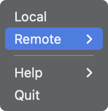
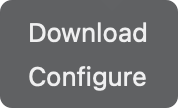
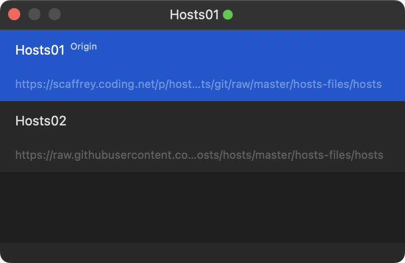
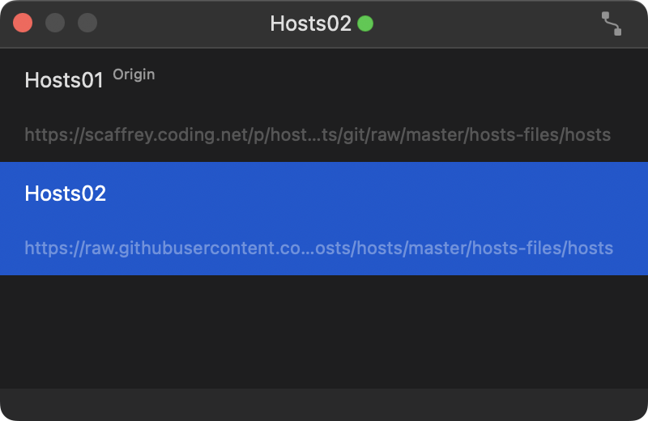
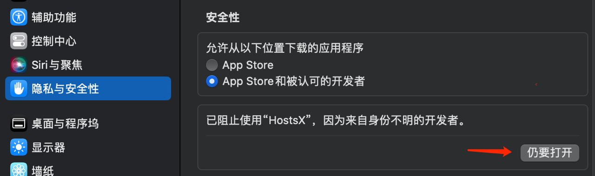

<h1>

<p>HostsX</p>
<a href="https://github.com/ZzzM/HostsX/releases/latest"></a>
<a href="https://github.com/ZzzM/HostsX/releases/latest"></a>
<a href="https://raw.githubusercontent.com/ZzzM/HostsX/master/LICENSE"></a>
<a href="https://zzzm.github.io/2020/02/24/hostsx/">

</a>
</h1>

A lightweight macOS app for updating local hosts

## Features
- [x] Localization (简体中文、English)
- [x] Dark mode

## Compatibility
- **2.9.0** requires **macOS 10.13** or later
- **<= 2.8.2** requires **macOS 10.12** or later

## Changelogs
- [简体中文](changelogs/CHANGELOG_SC.md)
- [English](changelogs/CHANGELOG.md)

## Snapshots

### 2.9.0

- Menubar

     

 
    `Local`: Import a hosts to replace local hosts

    `Reset`: Reset local hosts to default
   
  
- Remote

    


    `Sync Button`: Download default remote hosts and overwrite local hosts

    `Add Button`: Add a remote source


### 2.8.2

- Menubar

     
     

    `Local`: Import a hosts to replace local hosts

    `Remote - Download`: Download default remote hosts and overwrite local hosts

- Remote

    

    `Orign`: It indicates that this is a default source

    

    `Orign Button (Top right corner)`: Set a remote source as default source 
   
    
    
    `More Menu`:  Right click to show
    
    `Open Button (1st Menu item)`: Open a remote source with your browser

    `Add Button (2nd Menu item)`: Add a remote source

    `Remove Button (3rd Menu item)`: Remove a remote source
    

## FAQ

1. **"HostsX" is damaged and can't be opened.**

    

    Or open `Terminal` and run  

    ```shell
    sudo xattr -r -d com.apple.quarantine /Applications/HostsX.app
    ```
2. **How to synchronize remote hosts**

    2.9.0
    1. Set a remote source as default source
    2. Click `Sync Button`

    2.8.2
    1. Click `Orign Button` to set a remote source as default source
    2. Open app menubar menu
    3. Click `Remote - Download`

3. **How to avoid overwriting your local hosts (Only Remote)**

    Put the content that you don't want to be overwritten between `# My Hosts Start` and `# My Hosts End`, like below
    ```
    # My Hosts Start

    the content that you don't want to be overwritten

    # My Hosts End

    the content from a remote source
    ```
4. **What's the `hosts_old`**
    
    When completing a local or remote operation, it will create a `hosts_old` to record the contents before the changes


## Dependencies
- [Sparkle](https://github.com/sparkle-project/Sparkle)
