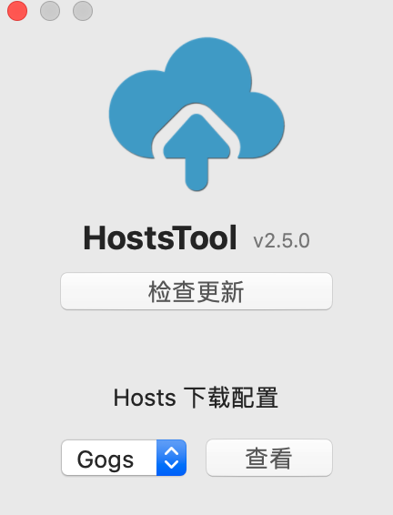

# HostsTool For macOS

#### [**HostsTool For macOS**](https://github.com/ZzzM/HostToolforMac)是Mac平台下的一个简易工具，来获取最新的[**hosts**](https://github.com/racaljk/hosts.git)更新。
开发语言：Swift 5 
运行环境：macOS 10.10 或以上 
最新版本：2.5.0  
支持语言：中、英  
下载地址：[Release](https://github.com/ZzzM/HostsToolforMac/releases)

### Version 2.5.0：
- 增加主页入口
- 重构设置面板
- 更新Hosts下载源

#### 增加主页入口

#### 重构设置面板

#### 更新Hosts下载源
[coding](https://scaffrey.coding.net/p/hosts/d/hosts/git/raw/master/hosts-files/hosts) 
[gogs](https://git.qvq.network/googlehosts/hosts/raw/master/hosts-files/hosts) 
[github](https://raw.githubusercontent.com/googlehosts/hosts/master/hosts-files/hosts)

### 注意
- 第一次更新会完全覆盖原hosts，然后生成“# My Hosts Start”、“# My Hosts End”标识,需要添加的话，只要在“# My Hosts Start”、“# My Hosts End”范围内编辑，
- 防止覆盖自己添加的hosts，只要在“# My Hosts Start”、“# My Hosts End”范围内编辑即可

